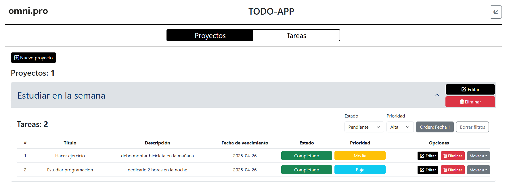
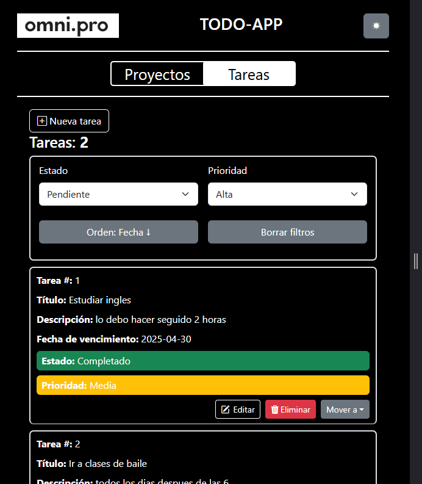

# OmniPro - TodoList

##### El objetivo es construir una aplicacion todo-list en la cual se puedan crear, listar, editar y eliminar tareas en una ruta especifica de la aplicacion (/tasks), esas tareas se iran listando de una en una y aparte de realizar las acciones basicas, cuenta con la opcion de "mover a" con el cual las tareas se podran mover a una lista de proyectos que el usuario cree.

Los proyectos se muestran en la vista de proyectos, aqui tambien se permite crear, listar, editar y eliminar proyectos igual que en la vista de tareas, tambien se pueden mover tareas entre proyectos dentro de esta vista, la aplicacion es muy intuitiva y de facil manejo.

por ultimo, las tareas cuentas con una serie de filtros en donde se puede ordenar por prioridad, estatus y fecha. tambien, cuenta con un boton para borrar los filtros en caso de que no se encuentren coincidencias

Tambien se le añade un tema (dark/light) en el header para mejor visualizacion cuando se vea la aplicación desde un telefono

#

## Screenshots






## Tecnologias usadas

- ReactJS
- TypeScript
- Bootstrap, Bootstrap Icons Y CSS
- React Router
- Github
- Jest
- Context Api

## Instalación

Verificar que se tenga Nodejs instalado o en una version superior a la 16 (v22.4.1) para la ejecucion de los comandos, tambien verificar que se tenga yarn instalado

```
- node -v ===> verificar version de node
- yarn -v ===> verificar yarn en el pc
```

Una vez descargado el repositorio, se puede ver el proyecto con un editor como VS Code o sublime, tambien, se puede abrir directamente desde una terminal para ejecutar los comandos

```sh
- cd omnipro-todolist-juanprieto
- yarn
- npm run dev
```

De esa forma, en la terminal, generara una url parecida a esta http://localhost:5173/ en donde se puede ver la app en un entorno local y de desarrollo

---

## Arquitectura usada

### 🧱 Estructura del proyecto

El proyecto está organizado en carpetas como:

- `components` para componentes reutilizables de UI
- `contexts` para manejar el estado global con Context API
- `reducers` para la lógica central del estado
- `typings` para definir interfaces y tipos con TypeScript
- `routes` para representar las vistas principales como `/tasks` y `/projects`

Esta división permite mantener el código modular, limpio y fácilmente escalable.

### 🔁 Manejo de estado

Se utiliza **Context API junto con `useReducer`** para manejar el estado global, dividiendo la lógica en:

- Proyectos (`projects`)
- Tareas (`tasks`)
  Las acciones como crear, editar, eliminar y mover tareas/proyectos están centralizadas en un único `todoReducer`.

### 🔂 Flujo de datos

El flujo de datos sigue un patrón unidireccional:

1. El usuario interactúa con la UI (inputs, botones)
2. Se dispara una función que despacha una acción al reducer
3. El estado global se actualiza
4. Los componentes se re-renderizan automáticamente con el nuevo estado

### 💾 Persistencia de datos

El estado de los proyectos se guarda en `localStorage`, permitiendo que la información persista al recargar la página.

### 🧪 Pruebas unitarias

Se utiliza **Jest** para las pruebas unitarias. Se testean funciones importantes como el `todoReducer` y los contextos para asegurar que las acciones funcionen correctamente y mantener la estabilidad del código.

### 🎨 UX/UI

Se utliza **Bootstrap** para visualizacion de modales, grillas de las tareasm diseño responsive y demas elementos que ofrece este framework

🧠 **Decisiones técnicas clave**

- Utilice React con TypeScript para aprovechar el tipado estático y mejorar la escalabilidad.
- El manejo del estado global se hizo con Context API y useReducer para mantener una estructura ligera, intuitiva y mantenible.
- Decidi almacenar los datos en localStorage para mantener la persistencia sin necesidad de backend.
- Decidi se dividir en contextos separados para mejorar la separación de responsabilidades.
- Implemente pruebas unitarias con Jest para asegurar el correcto funcionamiento del reducer. para los contextos no pude realizar las pruebas debido a que integre JSX en los mismos y necesitaba usar React Testing Library para ese fin pero nunca he trabajado esa tecnologia
- Añadi un sistema de filtros y ordenamiento para tareas según prioridad, estado y fecha de vencimiento.
- Se incluyó un selector de tema (dark/light) para mejorar la experiencia visual del usuario.
